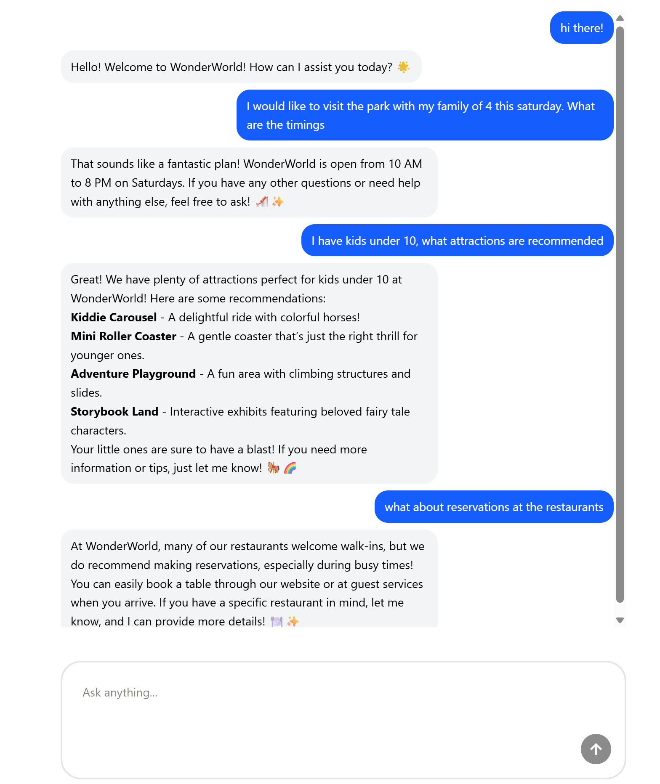

## 🔧 Backend: Clean Architecture + AI Integration

Built the backend with Express + TypeScript using a clean, modular structure.

Implemented a basic /api/chat endpoint to send prompts and receive model responses via the OpenAI API.

Added input validation, error handling, and conversation IDs to maintain context across turns.

Followed solid engineering principles by separating logic into controllers, services, repositories, and route handlers.

Practiced abstraction, exposing clear interfaces while keeping implementation details private.

---

## 💬 Frontend: Smooth, Polished Chat Experience

Built a responsive chat UI using React, Tailwind CSS, and shadcn/ui for a modern feel.

Used react-hook-form to manage user input and form state.

Implemented clean message rendering with markdown support for richer outputs.

Added typing indicators, auto-scrolling, and safeguards against empty messages for better UX.

Refactored the UI into modular components like ChatInput, ChatMessages, and TypingIndicator.

---

## 🤝 What I Learned

How to integrate LLMs into real-world apps using the OpenAI API.

How to keep models grounded with domain-specific context using prompt engineering.

The importance of separation of concerns, clean abstractions, and maintainable code structure — fundamentals that scale.

A full, end-to-end understanding of building AI-driven experiences, not just calling an API.

---

# Setup instructions

To install dependencies:

```bash
bun install
```

To run:

```bash
bun run index.ts
```

This project was created using `bun init` in bun v1.3.3. [Bun](https://bun.com) is a fast all-in-one JavaScript runtime.

---

# User Interface


